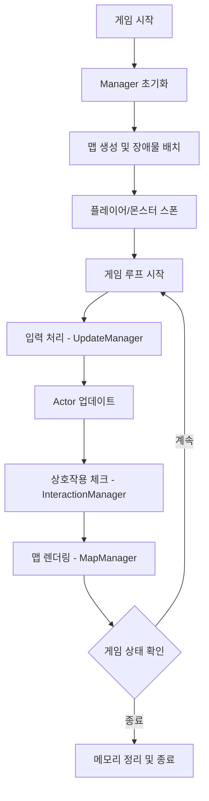
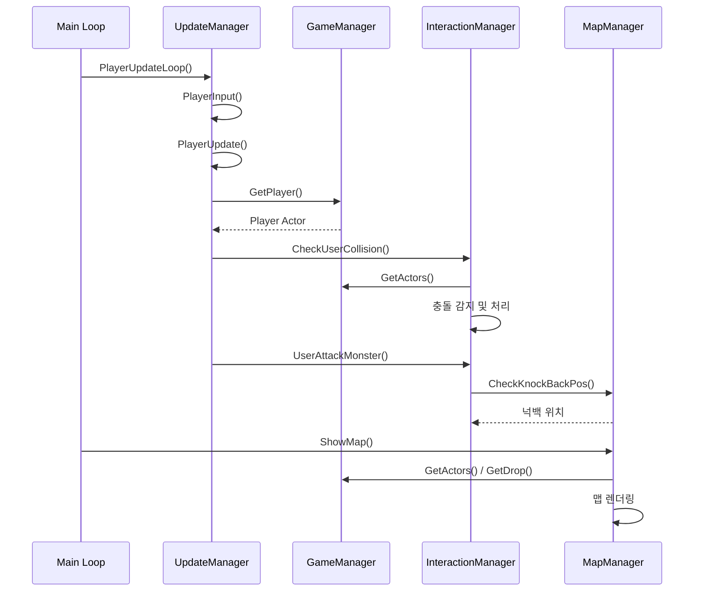
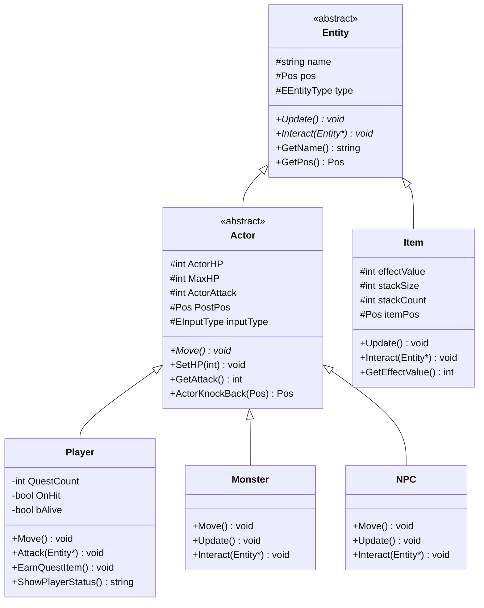
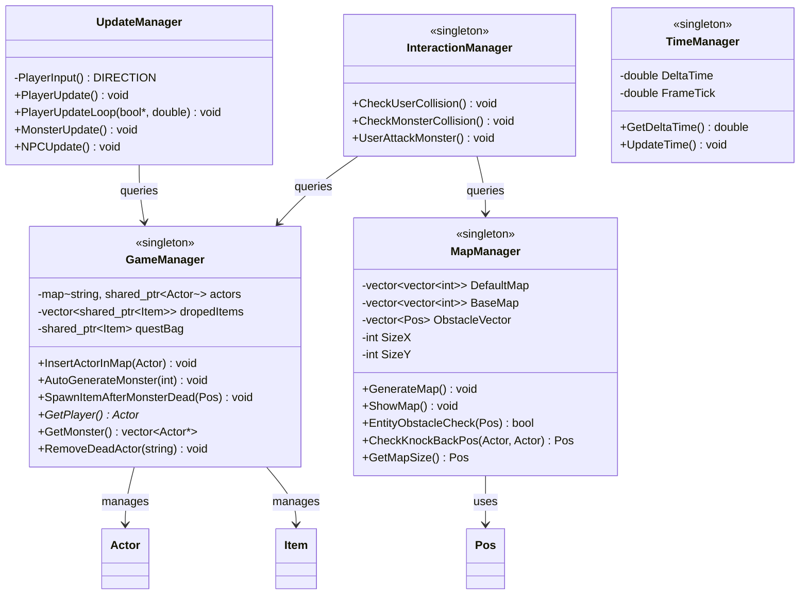

# ProjectCZelda - 콘솔 RPG 아키텍처 문서

## 목차
1. [프로젝트 개요](#1-프로젝트-개요)
2. [시스템 플로우차트](#2-시스템-플로우차트)
3. [핵심 아키텍처 분석](#3-핵심-아키텍처-분석)
4. [주요 시스템 상세 설명](#4-주요-시스템-상세-설명)
5. [디자인 패턴 및 구현 전략](#5-디자인-패턴-및-구현-전략)
6. [기술 부채 및 개선 방향](#6-기술-부채-및-개선-방향)
7. [결론](#7-결론)

---

## 1. 프로젝트 개요

> 🎮 콘솔 기반 C++ RPG 프로젝트

`프로젝트 이름`: **ProjectCZelda**  
`Power Point`: [PPT](https://naver.me/xGFmXztx) | [PDF](https://naver.me/xHmDH7NB)  
`Source & Demo`: [네이버 MYBOX](https://naver.me/GEiIWgva)

### 1.1 프로젝트 목적
Windows 콘솔 환경에서 작동하는 **젤다 스타일 2D RPG 게임** 구현  
C++ 기반 객체지향 설계 및 게임 아키텍처 학습

### 1.2 핵심 기술 스택
- **언어**: C++14
- **개발 환경**: Visual Studio 2022
- **실행 방식**: Windows Console Application
- **주요 라이브러리**: STL (map, vector, shared_ptr)

### 1.3 주요 특징
- **싱글톤 매니저 구조**: 게임의 핵심 시스템을 독립적인 Manager로 분리
- **상속 기반 Entity 시스템**: 다형성을 활용한 Actor/Item 관리
- **시간 제어 기반 업데이트**: 프레임 독립적인 게임 로직
- **동적 몬스터 생성**: 자동 스폰 및 아이템 드롭 시스템

---

## 2. 시스템 플로우차트

### 2.1 전체 게임 플로우


### 2.2 Manager 간 상호작용 플로우


---

## 3. 핵심 아키텍처 분석

### 3.1 Entity 계층 구조



#### 3.1.1 Entity 추상 클래스
모든 게임 객체의 기반 클래스로, 다음을 제공합니다:
- **공통 속성**: `name`, `pos`, `type`
- **추상 메서드**: `Update()`, `Interact(Entity*)`
- **목적**: 다형성을 통한 통합 관리

#### 3.1.2 Actor 클래스
이동 및 전투가 가능한 캐릭터의 기반 클래스:
- **전투 속성**: `ActorHP`, `ActorAttack`, `MaxHP`
- **이동 관리**: `PostPos` (이전 위치 저장), `inputType` (방향)
- **핵심 기능**: 
  - `ActorKnockBack()`: 피격 시 넉백 처리
  - `ActorRollBack()`: 충돌 시 이전 위치로 복귀

#### 3.1.3 Player 클래스
플레이어 캐릭터의 고유 기능:
- **퀘스트 시스템**: `QuestCount` 관리
- **전투 시스템**: `Attack()` 메서드, `OnHit` 플래그
- **생존 상태**: `bAlive` 플래그

#### 3.1.4 Item 클래스
필드에 드롭되는 아이템:
- **회복 아이템** (`heart`): HP 회복
- **퀘스트 아이템** (`quest`): 퀘스트 진행용
- **스택 시스템**: `stackSize`, `stackCount`

---

### 3.2 Manager 시스템 상세 구조



#### 3.2.1 GameManager (게임 핵심 컨트롤러)

**책임:**
- Actor 및 Item 생명주기 관리
- 몬스터 자동 생성 및 배치
- 아이템 드롭 시스템

**핵심 메서드:**
```cpp
void InsertActorInMap(shared_ptr<Actor> actor);
// Actor를 게임에 등록

void AutoGenerateMonster(int n);
// n개의 몬스터를 랜덤 위치에 생성

void SpawnItemAfterMonsterDead(const Pos& pos);
// 몬스터 사망 시 확률적으로 아이템 드롭
```

**데이터 구조:**
- `map<string, shared_ptr<Actor>> actors`: 이름 기반 Actor 검색
- `vector<shared_ptr<Item>> dropedItems`: 필드 아이템 목록

#### 3.2.2 MapManager (맵 관리 및 렌더링)

**책임:**
- 맵 생성 및 장애물 배치
- 콘솔 렌더링
- 충돌 감지 및 경계 체크

**핵심 메서드:**
```cpp
void ShowMap();
// 전체 맵을 콘솔에 렌더링 (Actor, Item, 장애물 포함)

bool EntityObstacleCheck(Pos& pos, string actorName="");
// 해당 위치에 장애물이나 다른 Entity가 있는지 확인

Pos CheckKnockBackPos(shared_ptr<Actor> Target, shared_ptr<Actor> Attacker);
// 넉백 방향 계산 (장애물 고려)
```

**렌더링 최적화:**
- `MoveCursorToTopLeft()`: 커서를 화면 상단으로 이동하여 깜빡임 최소화
- 3개의 맵 버퍼 사용: `DefaultMap`, `BaseMap`, `CopyMap`

#### 3.2.3 UpdateManager (입력 및 업데이트 처리)

**책임:**
- 플레이어 입력 처리
- Actor 업데이트 루프 관리

**핵심 메서드:**
```cpp
void PlayerUpdateLoop(bool* gamestate, double frametick);
// 메인 게임 루프 (입력 → 업데이트 → 렌더링)

DIRECTION PlayerInput();
// 키보드 입력을 방향으로 변환 (W/A/S/D, Space)
```

#### 3.2.4 InteractionManager (상호작용 처리)

**책임:**
- 충돌 감지
- 전투 처리
- 아이템 획득

**핵심 메서드:**
```cpp
void CheckUserCollision();
// 플레이어와 몬스터/NPC/아이템 충돌 체크

void UserAttackMonster();
// 플레이어 공격 판정 및 데미지 처리
```

#### 3.2.5 TimeManager (시간 제어)

**책임:**
- 프레임 독립적인 게임 로직
- DeltaTime 계산

---

## 4. 주요 시스템 상세 설명

### 4.1 맵 시스템

#### 4.1.1 맵 생성 알고리즘
```cpp
void MapManager::GenerateMap()
{
    // 1. DefaultMap 초기화 (모든 타일을 ROAD로)
    // 2. GenObstacle()로 장애물 배치
    // 3. BaseMap에 복사 (원본 보존)
}
```

**맵 타일 타입:**
- `ROAD`: 이동 가능한 일반 타일
- `OBSTACLE`: 장애물 (이동 불가)
- `EXIT`: 출구 타일

#### 4.1.2 렌더링 시스템
```cpp
void MapManager::ShowMap()
{
    // 1. BaseMap을 CopyMap에 복사
    // 2. Actor 위치에 '@', 'M', 'N' 표시
    // 3. Item 위치에 'H', 'Q' 표시
    // 4. 커서를 (0,0)으로 이동 후 출력
}
```

**성능 이슈:**
- 매 프레임마다 전체 맵을 재렌더링하여 대규모 맵에서 성능 저하
- 향후 개선: 변경된 타일만 업데이트하는 Dirty Flag 패턴 고려

---

### 4.2 전투 시스템

#### 4.2.1 플레이어 공격
```cpp
void Player::Attack(Entity* other)
{
    // 1. 공격 방향 설정
    // 2. InteractionManager::UserAttackMonster() 호출
    // 3. 몬스터 HP 감소 및 넉백 처리
}
```

#### 4.2.2 충돌 및 데미지 처리
- 플레이어와 몬스터가 같은 위치에 있으면 플레이어가 피격
- 몬스터 사망 시 `GameManager::SpawnItemAfterMonsterDead()` 호출

---

### 4.3 아이템 시스템

#### 4.3.1 아이템 드롭 메커니즘
```cpp
void GameManager::SpawnItemAfterMonsterDead(const Pos& pos)
{
    // 1. 랜덤 확률로 아이템 생성 여부 결정
    // 2. Heart 또는 Quest 아이템 생성
    // 3. dropedItems 벡터에 추가
}
```

#### 4.3.2 아이템 획득
- 플레이어가 아이템과 같은 위치에 도달하면 자동 획득
- `Heart`: 즉시 HP 회복
- `Quest`: 인벤토리에 저장 (`questBag`)

---

## 5. 디자인 패턴 및 구현 전략

### 5.1 적용된 디자인 패턴

#### 5.1.1 Singleton Pattern (싱글톤 패턴)
```cpp
class GameManager
{
private:
    GameManager() {}
    GameManager(const GameManager& ref) {}
    GameManager& operator=(const GameManager& ref) {}
    
public:
    static GameManager& GetInstance()
    {
        static GameManager GM;
        return GM;
    }
};
```

**적용 대상:**
- `GameManager`
- `MapManager`
- `InteractionManager`

**이유:**
- 게임 전역에서 단일 인스턴스만 필요
- 전역 접근 지점 제공

#### 5.1.2 Template Method Pattern (상속 및 다형성)
```cpp
class Entity
{
public:
    virtual void Update() = 0;
    virtual void Interact(Entity* other) = 0;
};

class Player : public Actor
{
public:
    virtual void Update() override { /* 플레이어 전용 로직 */ }
    virtual void Interact(Entity* other) override { /* 상호작용 */ }
};
```

**장점:**
- 공통 인터페이스로 다양한 Entity 통합 관리
- 런타임 다형성을 통한 유연한 동작

#### 5.1.3 Smart Pointer (메모리 관리)
```cpp
map<string, shared_ptr<Actor>> actors;
vector<shared_ptr<Item>> dropedItems;
```

**이유:**
- 자동 메모리 해제 (메모리 누수 방지)
- 참조 카운팅을 통한 안전한 객체 공유

---

### 5.2 데이터 구조 전략

#### 5.2.1 Actor 관리: `map<string, shared_ptr<Actor>>`
**장점:**
- 이름 기반 빠른 검색 (O(log n))
- 플레이어, NPC 등 고유 이름을 가진 Actor에 적합

**단점:**
- 몬스터처럼 다수의 동일 타입 객체 관리 시 비효율적
- 순회 시 vector보다 느림

#### 5.2.2 Item 관리: `vector<shared_ptr<Item>>`
**장점:**
- 순차 접근에 최적화
- 메모리 지역성 우수

**단점:**
- 특정 아이템 검색 시 O(n)

---

### 5.3 시간 기반 업데이트 시스템

```cpp
void UpdateManager::PlayerUpdateLoop(bool* gamestate, double frametick)
{
    while (*gamestate)
    {
        // 1. DeltaTime 계산
        // 2. 입력 처리
        // 3. 업데이트
        // 4. 렌더링
        // 5. frametick만큼 대기 (프레임 제한)
    }
}
```

**목적:**
- 프레임레이트에 독립적인 게임 로직
- 일정한 게임 속도 유지

---

## 6. 기술 부채 및 개선 방향

### 6.1 현재 제한사항

#### 6.1.1 렌더링 성능
**문제:**
- `MapManager::ShowMap()`이 매 프레임 전체 맵을 재렌더링
- 대규모 맵(50x50 이상)에서 눈에 띄는 성능 저하

**시도한 최적화:**
- 커서 이동을 통한 깜빡임 감소
- 버퍼 맵 사용

**향후 개선:**
- Dirty Flag 패턴: 변경된 타일만 업데이트
- WinAPI 기반 GUI 렌더링으로 전환

#### 6.1.2 Entity 데이터 분산 관리
**문제:**
- Actor는 `map`에, Item은 `vector`에 분산 저장
- 일관성 없는 접근 방식으로 코드 복잡도 증가

**향후 개선:**
- Entity 통합 컨테이너 구조 재설계
- Entity Component System (ECS) 도입 고려

#### 6.1.3 Manager 간 결합도
**문제:**
- `InteractionManager`와 `UpdateManager`의 책임이 명확히 분리되지 않음
- Manager 간 순환 의존성 존재

**향후 개선:**
- 명확한 책임 분리 (SRP 원칙)
- 이벤트 시스템 도입으로 결합도 감소

---

### 6.2 향후 개선 계획

1. **GUI 렌더링 전환**
   - WinAPI 또는 SDL 사용
   - 그래픽 타일 및 스프라이트 지원

2. **컴포넌트 기반 Actor 구성**
   - `HealthComponent`, `MovementComponent` 등으로 분리
   - 재사용성 및 확장성 향상

3. **네트워크 멀티플레이어**
   - 클라이언트-서버 아키텍처
   - 동기화 및 지연 보상

4. **세이브/로드 시스템**
   - JSON 기반 직렬화
   - 게임 상태 저장 및 복원

---

## 7. 결론

### 7.1 핵심 성과

본 프로젝트는 **C++ 객체지향 설계**와 **게임 아키텍처 패턴**을 실전에 적용한 학습 프로젝트입니다.

**주요 성과:**
- ✅ **싱글톤 패턴**: Manager 시스템 구축
- ✅ **상속 및 다형성**: Entity 계층 구조 설계
- ✅ **스마트 포인터**: 안전한 메모리 관리
- ✅ **시간 기반 업데이트**: 프레임 독립적 게임 로직

### 7.2 학습한 내용

1. **게임 루프 아키텍처**: 입력 → 업데이트 → 렌더링 사이클
2. **충돌 감지 및 물리**: 넉백, 경계 체크
3. **동적 객체 관리**: 몬스터 스폰, 아이템 드롭
4. **콘솔 렌더링 최적화**: 버퍼링, 커서 제어

### 7.3 향후 발전 방향

이 프로젝트는 **기초적인 게임 엔진 구조**를 이해하는 출발점입니다.  
향후 Unreal Engine, Unity 등 상용 엔진을 학습할 때, 본 프로젝트에서 구현한 개념들이 어떻게 확장되고 최적화되는지 비교하며 성장할 수 있습니다.
